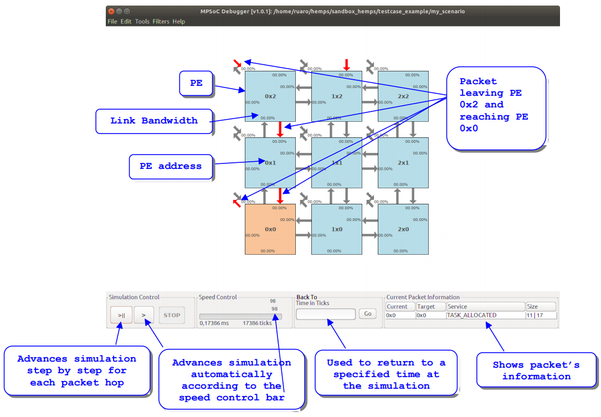

# MA-Memphis

Application-Managed Many-core Modeling Platform for Heterogenous SoCs

## About

MA-Memphis is a platform derived from [Memphis](https://github.com/gaph-pucrs/Memphis), which is based on [HeMPS](https://github.com/gaph-pucrs/hemps). 
MA-Memphis is a full many-core model with:
* SystemC-modeled hardware
* C Kernel
* Standard set of applications
* Standard set of Management Application
* Scenario generation
* [Debug tools](https://github.com/gaph-pucrs/GraphicalDebugger)

The chip area is divided in two regions: GPPC (General Purpose Processing Cores) and Peripherals.
For more information, check the [platform documentation](/docs/Platform.md).

## Installation

The MA-Memphis platform is made to run in a Linux environment.
It is possible to use the WSL to run MA-Memphis platform under Windows.
Check our [guide](docs/WSL.md) to the MA-Memphis under WSL to set-up and then follow the steps below.

### Pre-requisites

* GCC (base development packages, check [how to acquire GCC](docs/gcc.md))
* mips-elf-gcc (to compile OS and applications, check [how to acquire MIPS cross-compiler](docs/mips.md))
* SystemC (to compile hardware model, check [how to acquire SystemC](docs/systemc.md))
* Python and needed libraries (to generate platform, check [how to acquire Python](docs/python.md))
* Graphical Debugger (optional, check [how to acquire Debugger](docs/Debugger.md))

### Acquiring MA-Memphis

Clone this repository.
The master branch is the latest release without development commits.
In this example we chose the home directory.

```console
$ cd ~
$ git clone https://github.com/gaph-pucrs/MA-Memphis.git
```

Create a directory for sandboxing the experiments:
```console
$ mkdir ~/sandbox_memphis
```

Export the environment variables. Here we do it persistently with .bashrc. Remember to close and reopen the terminal after running: 
```console
$ echo -e "# MA-Memphis\nexport MA_MEMPHIS_PATH=~/MA-Memphis\nexport MEMPHIS_HOME=~/sandbox_memphis\nexport PATH=\${MA_MEMPHIS_PATH}/build_env/bin:\${PATH}\n" >> ~/.bashrc
```

## Generating the model

First, enter the sandbox directory:
```console
$ cd $MEMPHIS_HOME
```

MA-Memphis separates the _testcase_ from the _scenario_.
A testcase contains a description of the hardware and operating system of the platform.
Create a new yaml file (here the example name will be testcase.yaml) in the sandbox folder containing:
```yaml
sw:                         # Operating System properties
  max_tasks_app: 10         # Maximum number of tasks per application allowed
management:                 # Management application properties
  - task: mapper_task       # The first in this list should ALWAYS be mapper_task
    static_mapping: [0,0]   # and the mapper_task should ALWAYS have static_mapping to any desired PE
  - task: migration_task    # migration_task is a QoS decider for real-time applications
  - task: rt_monitor        # rt_monitor is a QoS observer for real-time applications
    static_mapping: [0,1]   # Static mapping is optional for any other management task.
hw:                         # Hardware properties
  page_size_KB: 32          # Size of each memory page (maximum task size)
  tasks_per_PE: 4           # Maximum number of tasks in the same PE (will define memory size)
  model_description: sc     # Hardware description model. Currently, only sc is supported.
  noc_buffer_size: 8        # Size of the NoC buffer
  mpsoc_dimension: [3,3]    # Dimension of the many-core
  Peripherals:              # Attached peripherals
    - name: APP_INJECTOR    # Mandatory Application Injector peripheral
      pe: 2,2               # is at border PE 2,2
      port: N               # Connected at port NORTH. Note to use a border port.
    - name: MAINJECTOR      # Mandatory MA Injector peripheral
      pe: 0,0               # is connected at border PE 0,0
      port: S               # Connected at port SOUTH. Note to use a border port.

```

**WARNING:** The VHDL model supported by Memphis is still not validated with MA-Memphis.

The scenario contains a description of the applications that will be evaluated in the platform.
Create a yaml file (in this example we will use the name scenario.yaml) that contains:
```yaml
apps:                   # Application properties
  - name: synthetic     # Application synthetic
  - name: prod_cons     # Application prod_cons
    start_time_ms: 5    # Application start time. When absent is 0. Should be manually sorted.
    static_mapping:     # Optional static mapping
      prod: [1,1]       # prod task is static mapped to PE 1,1. Other tasks are dynamic mapped.
```

After creating the description of the testcase and the scenario, the testcase should be generated:
```console
$ mm-gen testcase.yaml
```

Then, the applications should be compiled:
```
$ mm-app testcase.yaml -all scenario.yaml
```

To stop the simulation before the ending time, kill the scenario process (without ".yaml"):
```console
$ killall scenario
```

## Simulating

To simulate the generated model, run inside the folder containing the testcase and scenario (the sandbox folder):

```console
$ mm-run testcase.yaml scenario.yaml 20
```

Where 20 is the simulation time in ms.

## Evaluating and Debugging

When the mm-run command executes, it runs the simulation and opens the graphical debugger.
To open manually after a simulation is already done, run:

```console
$ mm-debugger $MEMPHIS_HOME/testcase/scenario
```

### Main window

The main window contains the informations described in the image below.
Additional functionalities are:

* [Communication Overview](#communication-overview) (Tools->Communication Overview)
* [Task Mapping Overview](#task-mapping-overview) (Tools->Task Mapping Overview)
* [Debug Log Reader for MPSoCs (Deloream)](#debug-log-reader-for-mpsocs-deloream) (Tools->Deloream)
* PE Information (Click the desired PE)
  * [PE Log](#pe-log) (Log->Continuous Reading)
  * [Scheduling](#scheduling) (Scheduling->Open Scheduling Graph)



### Communication Overview

Shows the NoC traffic distributed among PEs.

### Task Mapping Overview

Shows tasks running in each mapped PE or tasks that already terminated.

### Debug Log Reader for MPSoCs (Deloream)

Shows by application and task the debug messages produced.

### PE Log

Shows all messages produced by the PE (including the kernel).

### Scheduling

Shows a scheduling graph of the selected PE.

### Further reading

Check the [GraphicalDebugger](https://github.com/gaph-pucrs/GraphicalDebugger) repository for more information.
A [video](https://youtu.be/nvgtvFcCc60) in portuguese is available showing all features of the Debugger.
